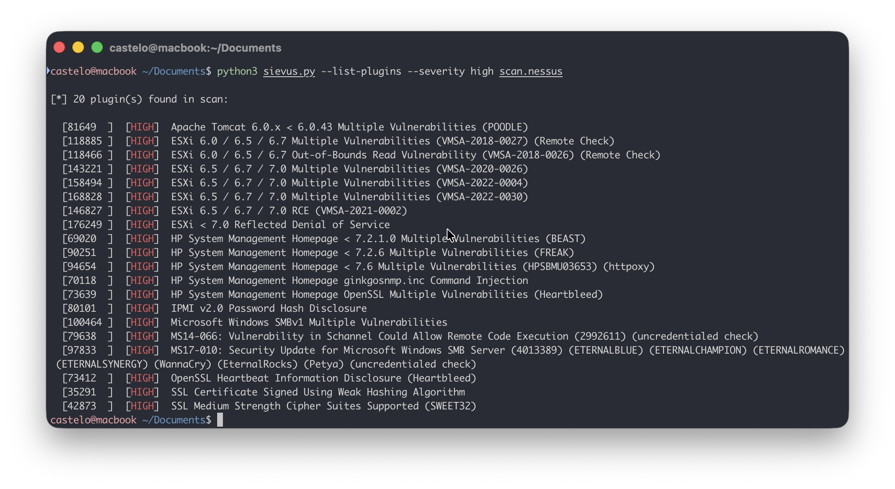

# Sievus
Extract vulnerable hosts from `.nessus` scan files. Filter by plugin name, plugin ID, or severity, and export results as `host:port` pairs ready for use in other tools.

<div align="center">
  
</div>

## Usage
The `.nessus` file can be placed anywhere in the command. All flags are optional and combinable.
```
python3 sievus.py <scan.nessus> [options]
```

### Options

| Flag | Short | Description |
|---|---|---|
| `--list-plugins` | | List all plugins found in the scan |
| `--plugin-name NAME` | | Filter by plugin name (partial match, case-insensitive) |
| `--plugin-id ID` | | Filter by numeric Nessus plugin ID |
| `--severity LEVEL [...]` | `-s` | Filter by severity: `none` `low` `medium` `high` `critical` |
| `--output FILE` | `-o` | Save `host:port` results to a file |

---

## Examples

**List all plugins found in the scan**
```bash
python3 sievus.py scan.nessus --list-plugins
```

**Filter by plugin name**
```bash
python3 sievus.py scan.nessus --plugin-name "sweet32"
```

**Filter by plugin ID**
```bash
python3 sievus.py scan.nessus --plugin-id 42873
```

**All critical hosts across every plugin**
```bash
python3 sievus.py scan.nessus --severity critical
```
```bash
python3 sievus.py scan.nessus --severity high medium low
```

## Output format

Results are printed grouped by plugin. The plugin name and severity appear once as a header, followed by the affected hosts:

```
[CRITICAL] SWEET32: Birthday attacks against TLS ciphers with 64bit block size
10.10.1.5:443
10.10.1.8:443
10.10.2.1:3389

[LOW] SSH Server CBC Mode Ciphers Enabled
10.10.1.5:22
10.10.1.9:22
```
